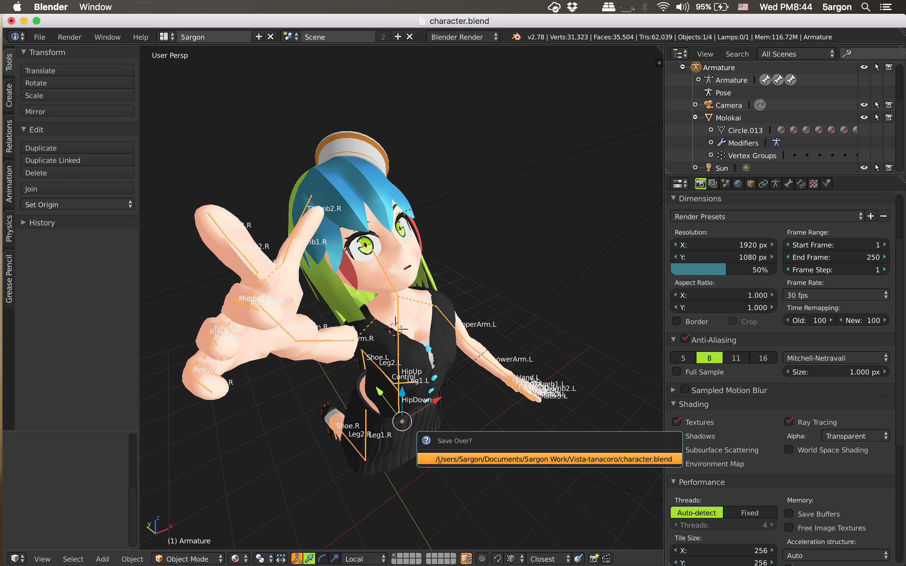
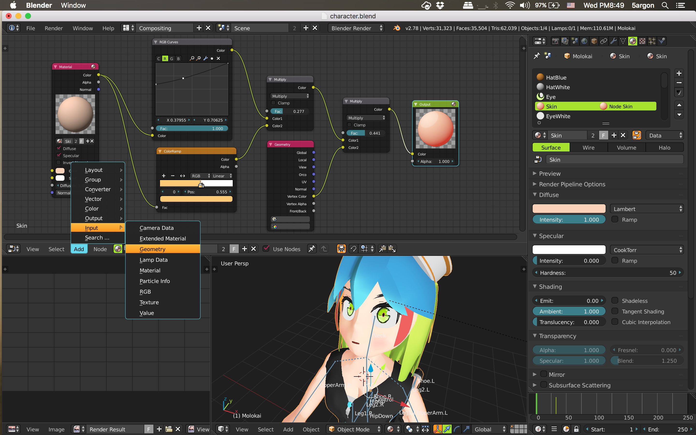

# monokai-blender
A Blender theme for programmers. 
(Inspired by the popular text editor theme "Monokai")

Goes well with your code editor!

## Features
- Monokai's strength : Dark yet fruity and playful. Can't live without!
- I have avoided using 100% white texts.
- Darker background on the 3D view. Slightly darker grid.
- Some texts are smaller for aesthetics.
- Cute pastel colored XYZ axis.
- Flat theme, most gradients and emboss removed except a subtle hint for tool buttons. All text shadows removed.
- All modeling-related colors are left untouched from the Blender's default theme. (e.g. selecting is still orange)

## Note
- Many screens that I did not use in my work might still be the default. (like Logic Editor, Console) If you use them and fix them you are welcome to open a pull request.
- I like the color green and choose it as a prominent color. If you would like to switch the four green-pink-blue-orange color of Monokai around you can go to `Preferences > Themes`. All the main colors are in `User Interface` tab.